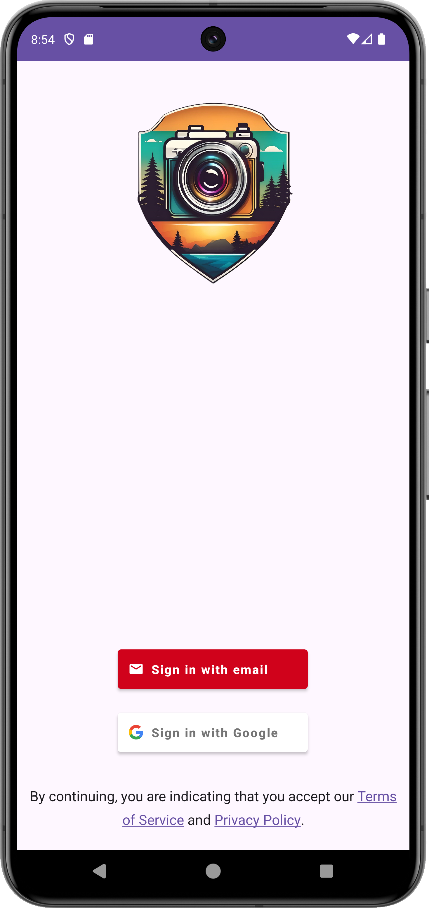
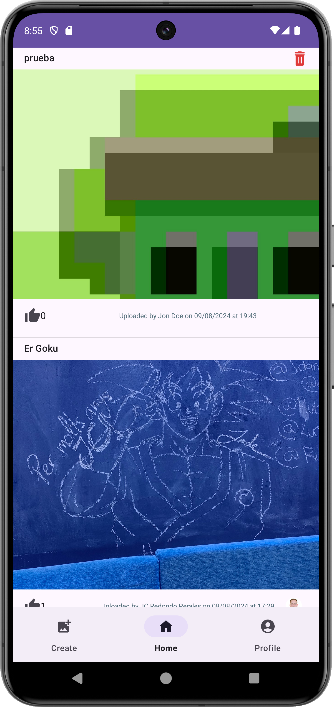
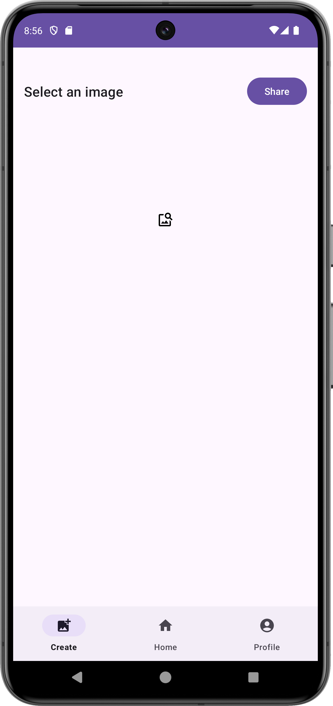
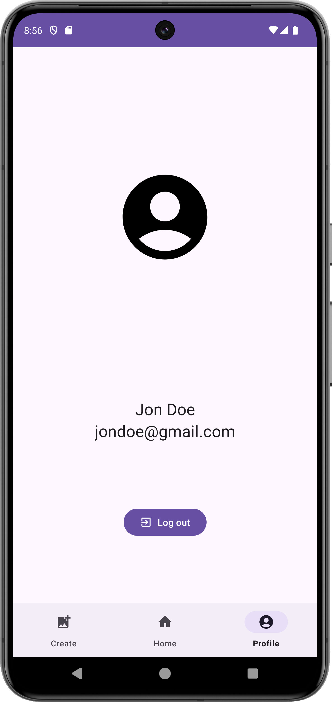

# Snapshots App 
 

Este proyecto es una aplicación Android desarrollada en Kotlin, que permite a los usuarios gestionar y compartir instantáneas. Los usuarios pueden añadir, editar, eliminar y compartir instantáneas. La aplicación utiliza Firebase para la persistencia de datos y autenticación, y sigue el patrón de diseño MVVM para su arquitectura.

## Características

- Ver una lista de instantáneas.
- Añadir nuevas instantáneas.
- Editar instantáneas existentes.
- Eliminar instantáneas.
- Compartir instantáneas.
- Persistencia de datos con Firebase.
- Autenticación de usuarios con Firebase.
- Arquitectura MVVM.

## Capturas de Pantalla



## Manual de Instrucciones para "Snapshots App"

### 1. Inicio de la aplicación
Al abrir "Snapshots App", serás recibido por la pantalla principal que muestra una lista de tus instantáneas guardadas.

### 2. Navegación principal
La interfaz es intuitiva, con una lista de instantáneas y un botón flotante en la esquina inferior derecha para añadir nuevas instantáneas.

### 3. Agregar una nueva instantánea
Para añadir una instantánea:
1. Pulsa el botón flotante "+".
2. Selecciona una imagen y rellena los detalles de la instantánea en el formulario.
3. Guarda la instantánea pulsando el icono de guardado.

### 4. Editar una instantánea
Para editar una instantánea:
1. Pulsa sobre la instantánea que deseas editar.
2. Modifica los detalles en el formulario.
3. Guarda los cambios.

### 5. Eliminar una instantánea
Para eliminar una instantánea, mantén presionada la instantánea que deseas eliminar y selecciona "Eliminar" en el menú de opciones.

### 6. Compartir una instantánea
Puedes compartir una instantánea pulsando el icono de compartir en la lista de instantáneas.

### 7. Visualizar detalles de la instantánea
Pulsa sobre cualquier instantánea en la lista para ver todos sus detalles.

### 8. Acciones secundarias de las Instantáneas
Mantén pulsado en una instantánea para abrir un menú emergente con el que podrás:
1. Eliminar la instantánea.
2. Compartir la instantánea.

### 9. Soporte y contacto
Si tienes preguntas o necesitas soporte, por favor contacta a jlobatonm@gmail.com

## Tecnologías Utilizadas

- **Kotlin**: Lenguaje de programación.
- **Firebase**: Persistencia de datos y autenticación.
- **MVVM**: Patrón de arquitectura.
- **Android Studio**: Entorno de desarrollo integrado.

## Instalación

Para instalar y ejecutar este proyecto en tu entorno local, sigue estos pasos:

```bash
git clone https://github.com/JuanJoseLobatonMateos/snapshots-app.git
cd snapshots-app
